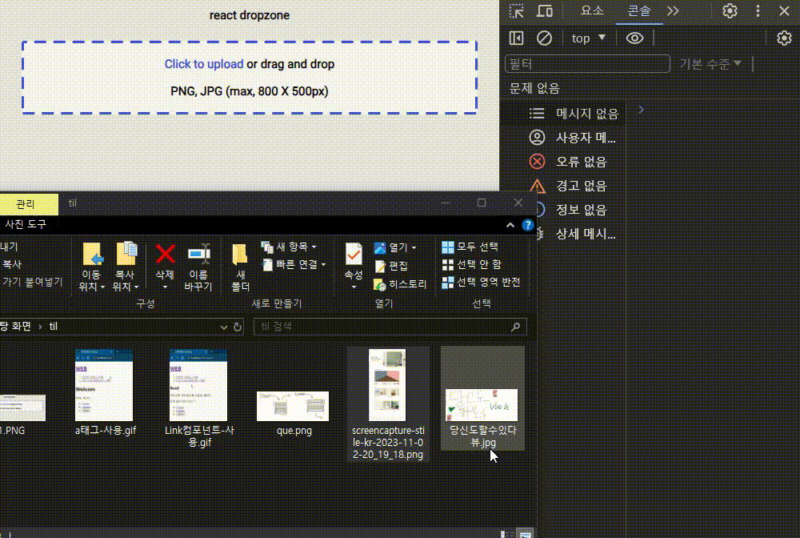
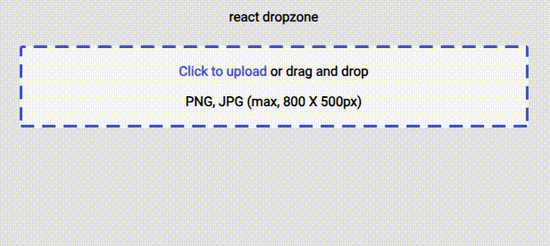

# React-DropZone


[](https://codesandbox.io/p/github/muzi55/react-dropZone/main?file=%2Fsrc%2FApp.js&embed=1&showConsole=true)
코드 샌드박스
<br />
[git link](https://github.com/muzi55/react-dropZone)
<br />
<br />

작업도중 파일 업로드 방식을 클릭 말고도 드래그 드롭으로 업로드하게끔 기획이 나왔다.

그에 맞춰 찾아보던중 react-dropzone 라이브러리를 발견해서 사용해 보았다.

[드랍존 npx 링크](https://www.npmjs.com/package/react-dropzone)
<br />

## install

```
yarn install
```

<br />
<br />

## 그래서 무엇을 했니?



이미지를 드래그 드롭으로 업로드 시킬 수 있게되었다.
<br />
<br />
<br />



**isDragActive** 를 사용하여 드래그된 상태를 컨트롤함
<br />
<br />
<br />

<!-- 아직 못한것은 input accept 속성과, 크기제한 이다. -->
