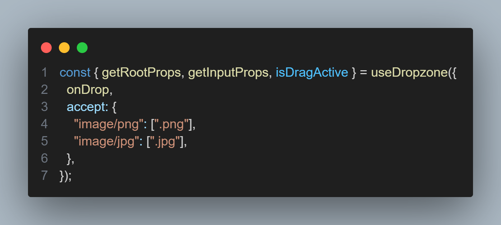
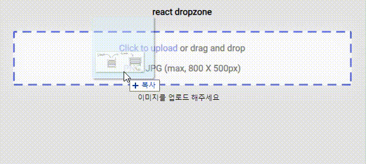

# React-DropZone


[](https://codesandbox.io/p/github/muzi55/react-dropZone/main?file=%2Fsrc%2FApp.js&embed=1&showConsole=true)
코드 샌드박스
<br />
[git link](https://github.com/muzi55/react-dropZone)
<br />
<br />

작업도중 파일 업로드 방식을 클릭 말고도 드래그 드롭으로 업로드하게끔 기획이 나왔다.

그에 맞춰 찾아보던중 react-dropzone 라이브러리를 발견해서 사용해 보았다.

[드랍존 npx 링크](https://www.npmjs.com/package/react-dropzone)
<br />

## install

```
yarn install
```

<br />
<br />

## 그래서 무엇을 했니?


이미지를 드래그 드롭으로 업로드 시킬 수 있게되었다.
<br />
<br />
<br />


**isDragActive** 를 사용하여 드래그된 상태를 컨트롤함
<br />
<br />
<br />

## accept

react-dropzone에서 accept 속성을 지정해줄 수 있다.



기존에 사용하던 input태그의 accept 속성처럼 사용하면 된다.<br />
이렇게 설정해놓으면 이미지 중에서 **png,jpg** 두가지의 파일확장자만 받게끔 되었다.

## 이미지 미리보기



이미지 미리보기 방식은 blob 을 사용했다.
<br />
<br />

```jsx
const onDrop = useCallback((acceptedFiles) => {
  const file = acceptedFiles[0];
  const blobURL = URL.createObjectURL(file);
  setImgSrc(blobURL);
}, []);
```

ondrop 기존에 있던 ondrop 함수에서 받아오는 파라미터의 값을 blob url로 만들어 그값을 state에 담아서 사용하는식으로 미리보기를 구현했다.
<br />
<br />

## 최종 코드

```jsx
import { useDropzone } from "react-dropzone";
import "./App.css";
import { useCallback, useState } from "react";
import img from "./assets/img/cloud-arrow-up.svg";

function App() {
  const [imgSrc, setImgSrc] = useState();
  const onDrop = useCallback((acceptedFiles) => {
    const file = acceptedFiles[0];

    const blobURL = URL.createObjectURL(file);
    setImgSrc(blobURL);
  }, []);

  const { getRootProps, getInputProps, isDragActive } = useDropzone({
    onDrop,
    accept: {
      "image/png": [".png"],
      "image/jpg": [".jpg"],
    },
  });

  return (
    <>
      <main>
        <h1>react dropzone</h1>
        <input type="file" name="" id="" {...getInputProps()} />
        <div className={`card-box ${isDragActive && "active"}`} {...getRootProps()}>
          <div className="card">
            <p>
              <span>Click to upload</span> or drag and drop
            </p>
            <p>PNG, JPG (max, 800 X 500px)</p>
          </div>
        </div>
        <div className="imgPreview">{imgSrc ?  : <div>이미지를 업로드 해주세요</div>}</div>
      </main>

      {isDragActive && (
        <div className="drag-active">
          
          <p>업로드할 파일을 드롭하세요.</p>
        </div>
      )}
    </>
  );
}

export default App;
```

이후 추가한다면 다중 선택, 이미지 삭제하기 종도 있을거같다.
